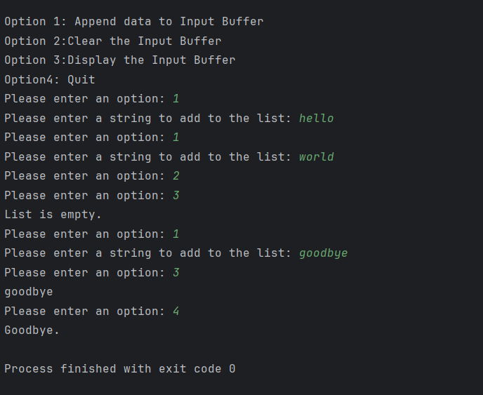
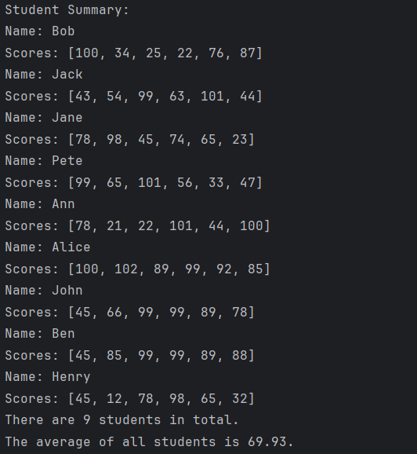
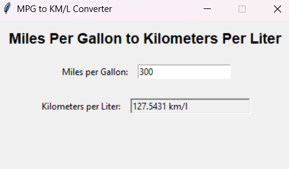

## Assignment 1

### Quick Start
This program asks if the user wants to append data to a list, display the list, or clear it. There is also the option to quit.

### Screenshot

## Assignment 2 

### Quick Start
This program interprets a preprovided file containing the list of student names and scores, parses the information, then displays the student's average as well as class' average.

### Screenshot

## Assignment 3

### Quick Start
This program is for a GUI to convert miles per gallon to kilometer per liter.
### Screenshot

